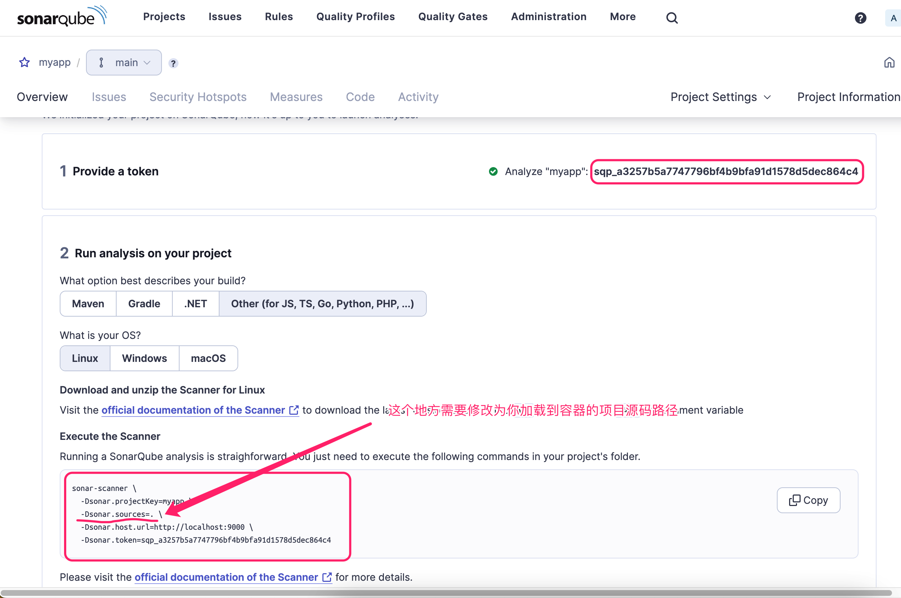
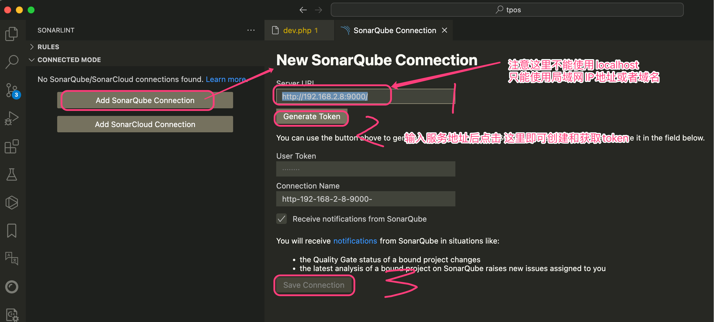
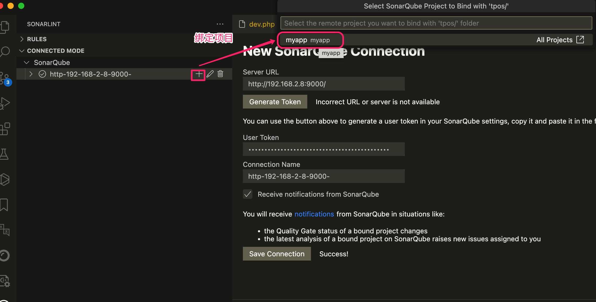

# sonarqube alpine docker

Alpine 版本 3.17
JDK版本 17.0.9_3.17  / 11.0.17  / 8u265

Sonarqube版本 9.9 LTS    10.3 ,  9.8 ,  9.7,  8.9,  7.9,   6.7,   5.6 

9.9以上版本需要 JDK17
9.8版本支持jdk11或者jdk17
7.x--9.7 jdk11

- 新版本查询页面 点击 From the zip file 这里即可查看需要的JDK版本
https://docs.sonarsource.com/sonarqube/latest/try-out-sonarqube/

历史版本发行包下载地址
https://www.sonarsource.com/products/sonarqube/downloads/historical-downloads/

发行包下载地址
https://binaries.sonarsource.com/Distribution/sonarqube/sonarqube-6.5.zip

- sonar-scanner版本发行地址
scanner5.x 需要jdk17版本
scanner4.8.1 是最后一个jdk11支持的版本

https://docs.sonarsource.com/sonarqube/9.9/analyzing-source-code/scanners/sonarscanner/

## 构建镜像
~~~sh
# sonarqube7.x 至 9.8版本最低需要 jdk11的支持
# sonar-scanner 5.x 必须jdk17+  
# sonar-scanner 4.8.1.3023 是最后一个JDK11的版本
# 
# 详见 build.sh
./build.sh

./build.sh -v 10.3.0.82913

./build.sh -v 9.9.3.79811

# 版本信息: JDK_MVER: 11.0 JRE_TAG=11.0.17-7-tse SONARQUBE_VERSION=9.8.0.63668 SONAR_SCANNER_VERSION=4.8.1.3023
./build.sh -v 9.8.0.63668 -j 11.0.17-7-tse -s 4.8.1.3023

# 版本信息: JDK_MVER: 11.0 JRE_TAG=11.0.17-7-tse SONARQUBE_VERSION=9.7.1.62043 SONAR_SCANNER_VERSION=4.8.1.3023
./build.sh -v 9.7.1.62043 -j 11.0.17-7-tse -s 4.8.1.3023

# 
# 8.x版本需要jdk11以上版本 jdk17也支持
# jdk17版本
./build.sh -v 8.9.10.61524 
# jdk11版本
./build.sh -v 8.9.10.61524 -j 11.0.17-7-tse -s 4.8.1.3023

# sonarqube 7.x 对应的JDK版本为 11  scanner版本 4.8.1.3023
./build.sh -v 7.9.6 -j 11.0.17-7-tse -s 4.8.1.3023

# 
# sonarqube6 包里面有内置的scanner, sonarqube5没有内置scanner
# 
./sonarqube6/build.sh
~~~

## 镜像测试
登录地址:http://localhost:9000
默认账号密码: admin/admin

~~~sh
# 测试是否正常运行 注意修改你的项目源码路径 $PWD/src
docker run --rm --name mysonarqube -p 9000:9000 -v $PWD/src:/usr/src tekintian/sonarqube:10.3.0.82913_17.0

# 等待容器启动后 登录http://127.0.0.1:9000 
# 点击 Create a local project->Locally 创建一个本地项目, 然后另外打开一个窗口 执行
docker exec -it mysonarqube sonar-scanner \
  -Dsonar.projectKey=myapp \
  -Dsonar.sources=/usr/src/myapp \
  -Dsonar.host.url=http://localhost:9000 \
  -Dsonar.token=sqp_a3257b5a7747796bf4b9bfa91d1578d5dec864c4
~~~

## 运行镜像
~~~sh
# 运行镜像
# conf/sonar.properties 这个配置文件中的所有配置项目,可以通过在环境变量中使用 CONF_配置KEY大写 的形式进行动态加载
# 如: 配置项 sonar.jdbc.username=sonarqube 可以通过设置 CONF_SONAR_JDBC_USERNAME="sonarqube" 环境变量来修改

docker run -itd --name mysonarqube \
	-p 9000:9000 \
	-e CONF_SONAR_JDBC_USERNAME="sonarqube" \
	-e CONF_SONAR_JDBC_PASSWORD="sonarqube888" \
	-e CONF_SONAR_JDBC_URL="jdbc:postgresql://192.168.2.8/sonarqube?currentSchema=public" \
	-v /Users/Tekin/src:/src \
	tekintian/sonarqube:9.9.3.79811

# 默认登录地址:  http://localhost:9000/ 账户: admin/admin
~~~

## sonar-scanner

执行扫描命令
~~~sh
# mysonarqube 是你自己创建的容器名称 sonar-scanner 是容器中的扫描命令 后面是扫描参数
docker exec -it mysonarqube sonar-scanner \
  -Dsonar.projectKey=myapp \
  -Dsonar.sources=/usr/src/myapp \
  -Dsonar.host.url=http://localhost:9000 \
  -Dsonar.token=sqp_a3257b5a7747796bf4b9bfa91d1578d5dec864c4
#  tpos 是项目名称
#  /src/myapp 这里表示的是你的源码的绝对路径, 需要再创建容器的时候通过 -v 加载到容器,否则这里访问不了. 在创建项目的时候就可以使用localy本地模式, 如果使用其他CI就不需要
#  sqp_a3257b5a7747796bf4b9bfa91d1578d5dec864c4 这个是你要扫描的项目的token
#  http://192.168.2.8:9000 是sonarqube的服务地址和端口
~~~

### scanner的配置文件

$SONAR_SCANNER_HOME/conf/sonar-scanner.properties
-e SCANNER_SONAR_HOST_URL="http://192.168.2.8:9000"
-e SCANNER_SONAR_SOURCEENCODING="UTF-8"

~~~sh
#----- Default SonarQube server
sonar.host.url=http://localhost:9000

#----- Default source code encoding
sonar.sourceEncoding=UTF-8
~~~

## 保存加载docker镜像

- save保存镜像文件
docker save tekintian/sonarqube:9.9.3.79811 > sonarqube_9.9.3.79811.tar

- load加载镜像
docker load < sonarqube_9.9.3.79811.tar

## Scanners

这个扫描服务, 如果有安装CI服务,则可以版本的CI自动执行,没有的话就使用本地模式, 

- 本地模式有2种使用方式,

1. 使用容器中的sonar-scanner服务扫描代码

   这个方式需要将项目加载到容器, 然后通过docker exec -it 容器名称 sonar-scanner 扫描参数

   如:

   docker exec -it mysonarqube sonar-scanner \
     -Dsonar.projectKey=myapp \
     -Dsonar.sources=/usr/src/myapp \
     -Dsonar.host.url=http://localhost:9000 \
     -Dsonar.token=sqp_a3257b5a7747796bf4b9bfa91d1578d5dec864c4

   

2. 自行下载sonar-scanner服务到本地电脑后指定sonarqube服务地址后运行扫描服务

   https://docs.sonarsource.com/sonarqube/9.9/analyzing-source-code/scanners/sonarscanner/

   下载后将sonar-scanner-5.0/bin 添加到你的PATH运行目录后 再却换到你的项目根目录, 然后执行

   ~~~sh
   # 注意  -Dsonar.sources=. 这里的.表示是当前目录
   sonar-scanner  -Dsonar.projectKey=myapp \
     -Dsonar.sources=. \
     -Dsonar.host.url=http://192.168.2.8:9000 \
     -Dsonar.token=sqp_a3257b5a7747796bf4b9bfa91d1578d5dec864c4
   
   ~~~

   

- 支持的 CI 服务:

Azure Pipelines
Bitbucket Pipelines
Cirrus CI
Codemagic
GitHub Actions
GitLab CI/CD
Jenkins (with the Branch Source plugin configured)
Manually setting branch parameters overrides automatic detection.

## 可用版本列表 verssions

命名规则
` tekintian/sonarqube:{SONARQUBE版本号}_{JDK版本号} `

版本列表:

tekintian/sonarqube:10.3.0.82913_17.0
tekintian/sonarqube:9.9.3.79811_17.0
tekintian/sonarqube:9.8.0.63668_17.0
tekintian/sonarqube:9.8.0.63668_11.0
tekintian/sonarqube:9.7.1.62043_17.0
tekintian/sonarqube:9.7.1.62043_11.0
tekintian/sonarqube:8.9.10.61524_11.0
tekintian/sonarqube:8.9.10.61524_17.0
tekintian/sonarqube:7.9.6_11.0

引用的JDK版本
tekintian/alpine-jre:11.0.21_3.17_jar
tekintian/alpine-jre:17.0.9_3.17_jar

sonarqube5 6使用的jdk版本
tekintian/alpine-jre:8u265-1-tse

tekintian/sonarqube:5.6.7
tekintian/sonarqube:6.7.7
tekintian/sonarqube:5.6
tekintian/sonarqube:6.5

## vscode 集成

安装插件 SonarLint  

https://marketplace.visualstudio.com/items?itemName=SonarSource.sonarlint-vscode

### Sonarqube CONNECTED MODE  链接配置

vscode菜单栏  查看 -->打开视图..  --> SonarLint --> Connected Mode

注意: 这里服务地址不支持localhost:9000 会提示  Incorrect URL or server is not available

只能使用本地局域网IP或者域名 

点击 Generae Token后会打开网页登录页面登录后点击 Allow connection即可自动创建和填入 user token

最后点击 Save Connection即可

###vscode绑定sonarqube项目

专业企业信息化软件定制开发, docker容器定制服务 咨询QQ:932256355

